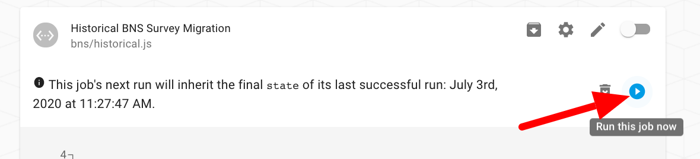

# Wildlife Conservation Society (OpenFn Jobs)

**N.B. commits to the `master` branch will automatically deploy to OpenFn.org**

# Project 1: BNS and NRGT Survey Integrations
## Kobo Toolbox template forms to integrate

- [x] BNS Survey --> OpenFn job [`bns/survey.js`](https://github.com/OpenFn/wcs/blob/master/bns/survey.js)
- [x] BNS Price --> OpenFn job [`bns/price.js`](https://github.com/OpenFn/wcs/blob/master/bns/price.js)
- [x] NRGT Historical --> OpenFn job [`nrgt/2017.js`](https://github.com/OpenFn/wcs/blob/master/ngrt/2017.js)
- [x] NRGT Current --> OpenFn job [`nrgt/2019.js`](https://github.com/OpenFn/wcs/blob/master/ngrt/2019.js)

## OpenFn jobs to _fetch_ Kobo data

- [x] Ongoing, timer-based fetch --> OpenFn job [`getKoboData.js`](https://github.com/OpenFn/wcs/blob/master/bns/getKoboData.js)
- [x] Historical, once-off fetch --> OpenFn job [`historical.js`](https://github.com/OpenFn/wcs/blob/master/bns/historical.js)

## Mappings

[See here](https://docs.google.com/spreadsheets/d/1EuSCOepC3gs8nRHlh9E4Tszi5txv__WxHkRAK80FMT4/edit#gid=0) for the mapping specifications defined by WCS.

- These jobs map to a MSSql database and leverage [OpenFn/language-mssql](https://github.com/OpenFn/language-mssql) and available helper functions.
- If WCS would like to connect with a **Postgres database**, it can leverage [OpenFn/language-postgresql](https://github.com/openfn/language-postgresql), however we would need to add more helper functions (e.g., `upsert()`, `insertMany()`) so that syntax from these initial jobs can easily be transferred. We could look into building some sort of hyper-generic `language-sql` package that worked across various sql DBs. This would be very under-powered (as it would struggle to reach the lowest-common-denominator for things like upsert) but might ultimately save WCS time if they plan to use two different kinds of database concurrently. **(Can WCS share feedeback here and confirm whether the Postgres DB structure will be the same as the Mssql DB?)**

### Assumptions

1. For idempotency, the jobs create a new Kobo `uuid` to map to the DB `DatasetUuidId`. This is a concatenation of Kobo `_id` + `_submission_time` + `_xform_id_string`. We cannot use Kobo `_uuid` because this is refreshed every time a Kobo submission is cleaned.
2. All data cleaning will be done in Kobo Toolbox. Every time Kobo data is synced with the DB, it will overwrite the records saved there and use the above `uuid` to upsert existing records.
3. In the [`bns/survey.js`](https://github.com/OpenFn/wcs/blob/master/bns/survey.js) job, we utiilize some of the Kobo form metadata to create data for the `bns_matrix` [L52-L65](https://github.com/OpenFn/wcs/blob/master/bns/survey.js#L52-L65) and `nr` [L42-L50](https://github.com/OpenFn/wcs/blob/master/bns/survey.js#L42-L50) question groups. It is therefore important that future versions of this form follow the same Kobo question naming conventions, otherwise the data will _not_ map as expected and the job may need to be modified.
4. OpenFn will only automatically fetch the Kobo surveys where the form Ids have been specified in the job [`getKoboData.js`](https://github.com/OpenFn/wcs/blob/master/bns/getKoboData.js). This is to allow WCS to identify which forms have historical data to be migrated one time using [`historical.js`](https://github.com/OpenFn/wcs/blob/master/bns/historical.js), and which forms should be synced on an ongoing basis using [`getKoboData.js`](https://github.com/OpenFn/wcs/blob/master/bns/getKoboData.js).

## Data Flows Supported

### (1) Scheduled Data Integration (Ongoing Sync)

1. On a scheduled-basis (e.g., every 3 hours), the OpenFn job [`1A. Get Kobo Data`](https://www.openfn.org/projects/1168/jobs/3562) (aka `getKoboData.js`) will run to fetch Kobo form data in bulk for the specified form Ids. _Before running the job, WCS should..._

- 1a. Update the survey Ids to fetched from Kobo toolbox (these can be copied from the URL of a Kobo form). In `https://kf.kobotoolbox.org/#/forms/aopf2bJ4cVqEXCrjnwAoHd/landing` then the string `aopf2bJ4cVqEXCrjnwAoHd` is the survey Id.
- 1b. Add the appropriate survey tag to indicate which mappings should be used to process the data. Tag options include: `bns_survey`, `bns_price`, `nrgt_current`, `nrgt_historical`.

```
surveys: [
      //** Specify new forms to fetch here **//
      //** Tag options: bns_survey, bns_price, nrgt_current, nrgt_historical  **//
      { id: 'aMpW7wwRBRbtCfidtK2rRn', tag: 'bns_survey' }, //BNS Ndoki 2019
      { id: 'new-form-id', tag: 'form_tag' }, //New Form Name
```

2. This job will post each individual Kobo survey back to the OpenFn inbox as an individual Message.
3. Message filter triggers will execute the relevant jobs (see above list) to process & load the data into the connect DB.
4. View **Activity History** to monitor the success of these integration flows.
5. If any Kobo data is cleaned, it will be fetched in the next job run (see step #1) and will overwrite\* the matching record in the DB.

\*Note these jobs have built-in transformations to create a **custom unique identifier** to map to the DB column `DatasetUuidId`, which can be used in the OpenFn job `upsert()` operations to ensure idempotency.

```
  cleanedSubmission.durableUUID = `${_submission_time}-${_xform_id_string}-${_id}`;
```

### (2) Historical Kobo Migrations (Once-off)

**Note:** OpenFn jobs support historical migrations for a total of 5,000 Kobo submissions. If WCS wishes to migrate a list of forms where the total submissions exceed 5k, it should either (a) break up the migration and repeat the following steps for smaller subsets of the forms, or (b) contact OpenFn for support running larger bulk migrations locally.

1. At any time, the OpenFn job [`1B. Get Historical Kobo Data`](https://www.openfn.org/projects/1168/jobs/3542) (aka `historical.js`) can be run on-demand to manually fetch historical Kobo data in bulk. _Before running the job, WCS should..._

- 1a. Update the survey Ids to fetched from Kobo toolbox (these can be copied from the URL of a Kobo form). In `https://kf.kobotoolbox.org/#/forms/aopf2bJ4cVqEXCrjnwAoHd/landing` then the string `aopf2bJ4cVqEXCrjnwAoHd` is the survey Id.
- 1b. Add the appropriate survey tag to indicate which mappings should be used to process the data. Tag options include: `bns_survey`, `bns_price`, `nrgt_current`, `nrgt_historical`.

2. When ready to sync the historical data, click "Run job" button.
   

### (3) Real-Time Integration (Not used, available as needed)

**Note:** This approach is not expected to be used because it is redundant to data flow #1, where data is already being fetched every 3 hours. However, this integration option remains available for scenarios where real-time data flow is important.

1. For some forms, WCS may prefer to configure a \*REST service\*\* in Kobo Toolbox to forward Kobo surveys to OpenFn for real-time processing (rather than having the above job sync the data on a timed basis).
2. To configure the Kobo REST service for real-time integration, see the [instructions here](https://docs.google.com/document/d/14V4GgvH2eorchO6s7AOwDCIkn4JhqBb6A6SsC46GJmY/edit?usp=sharing).
3. Every time WCS submits a new Kobo survey, the data will be forwarded automatically to the OpenFn Inbox. If the OpenFn jobs are "on", this data will be processed and forwarded onto the database automatically.

\*Note that this REST Service will not re-send Kobo data after it has been cleaned (only the initial submission). This is why the timer-based jobs are needed to sync cleaned Kobo data.

## Kobo Form Management

### Integrating New Kobo Forms

If WCS would like to integrate a new BNS or NRGT Kobo form with the database...

1. Delete any test submissions used in training/ testing.
2. Check if the form already has real submission data collected. If yes, add the `formId` to the [`1B. Get Historical Kobo Data`](https://www.openfn.org/projects/1168/jobs/3542) job and run it to first migrate the historical data to the database (see more in data flow #2 above).
3. Add the new `formId` and relevant `tag` to the job [`1A. Get Kobo Data`](https://www.openfn.org/projects/1168/jobs/3562) to fetch data for this form on an ongoing basis.

### Disconnecting Kobo Forms

To remove a Kobo form from the integration flow, edit the job [`1A. Get Kobo Data`](https://www.openfn.org/projects/1168/jobs/3562) (aka `getKoboData.js`) to remove the relevant form Id.

## Open Questions

1. Can WCS test to confirm the jobs are mapping data to Mssql as expected? [See this video for guidance](http://somup.com/cYQjQxX02A). Please pay special attention to the BNS Survey job, where the mapping logic is more complex and based on the form metadata.
2. Can WCS confirm the Postgres database we should also map these to? And should we map the exact same data to Postgres as we are to Mssql? Or will different surveys be mapped to different DBs?

# Project 2: Automated Postgres Table & Kobo Form Integration
## Summary
WCS would like to automate the configuration of destination database tables and OpenFn jobs to integrate Kobo data when new Kobo forms are uploaded to a connected Kobo account. How this will work: 
1. Job `automation/01-getForms.js` will run on a scheduled basis to check Kobo Toolbox for new forms. If any forms are created or updated, this will trigger 2 jobs to run.

2a. Job `02a-syncToPostgres.js` will upsert database tables in Postgres. If the table exists, but new Kobo questions have been added - the table will be updated to include additional columns. 

2b. Job `02b-syncToOpenFn.js` will upsert jobs in OpenFn to map the Kobo forms to the tables created in the above job. 

See [issue 7](https://github.com/OpenFn/wcs-consocsci/issues/7) documenting the original request. 

## Assumptions from engineering

1. We will check for new or changed forms in Kobo every 60 minutes.
2. We will not delete columns from tables in Postgres, ever.
3. Will will not modify columns in Postgres, ever.
4. When a new form is added to Kobo, we will create a corresponding table in
   Postgres.
5. When a form is modified in Kobo, if fields have been _added_, we will add
   those columns to the existing table in Postgres.
6. When a form is updated, records in "child" repeat group tables on Postgres
   will be purged and _then_ the current set of repeat group entries will be
   added as repeat group records in Postgres.
   
# Project 3: Wildmeat
See the Wildmeat repository. These jobs run on the `Wildmeat` OpenFn.org project. 
https://github.com/OpenFn/wcs-wildmeat
   

# Backlog/ Ideas
### 1. BNS and NGRT
1. Implement compatibility with Postgres (*This year?*)
2. Training for WCS admins on editing & writing basic jobs (*This year?*)

### 2. Kobo Automation Solution
1. Implement compatibility with mssql database
2. Auto-generate SQL queries for quicker analysis? 
3. Handling test data - is there a way to not write specific data to the DB? (Consider logic to check if test data before integrating with destination database)
4. Automatically build a "Data Dictionary" to track metadata in connected destination DBs if tables are auto-generated
5. Additional training for administrators in other organizations

### 3. Wildmeat
1. Updates to map species codes to specific species/ taxon records in a reference table
2. Support for future surveys with other consumption types (i.e., hunter, market)
3. Support for urban consumption forms
