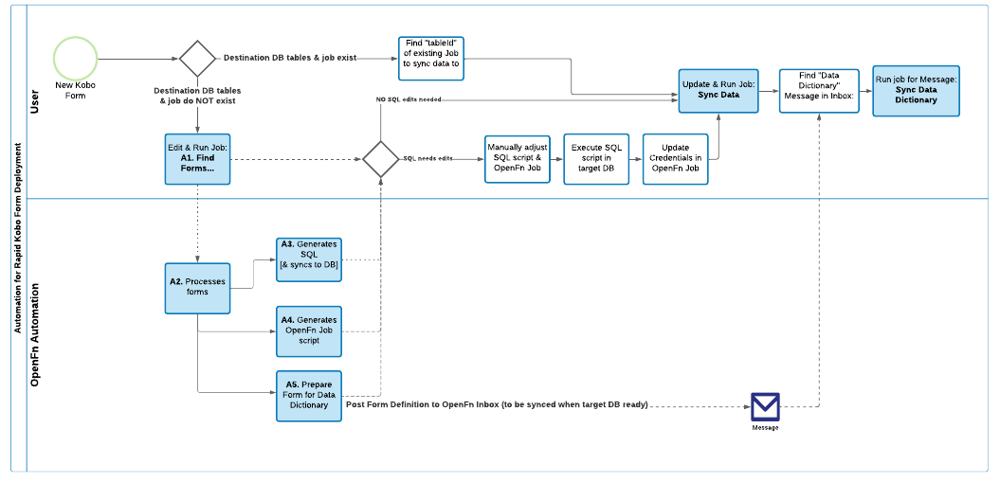
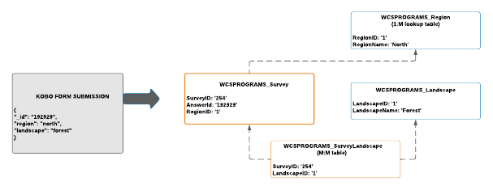
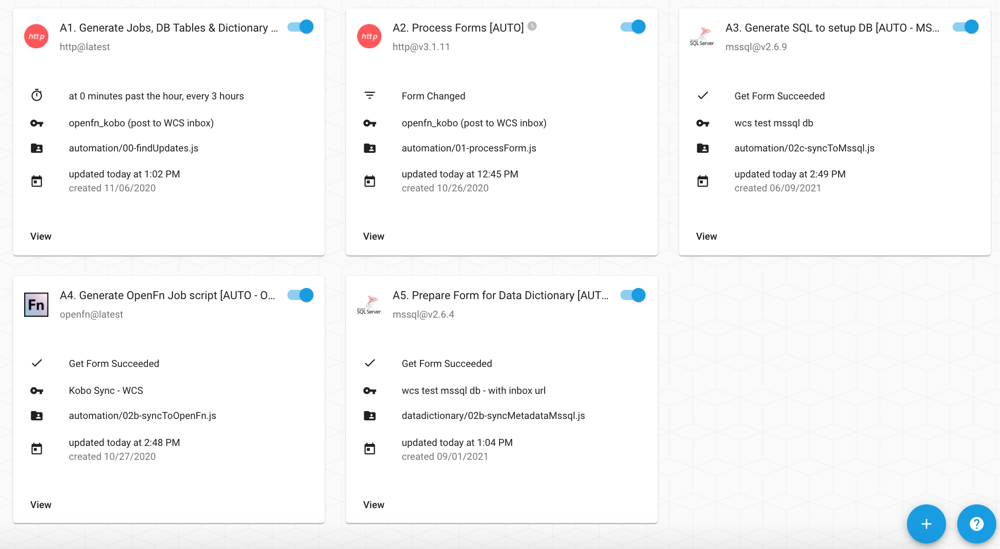
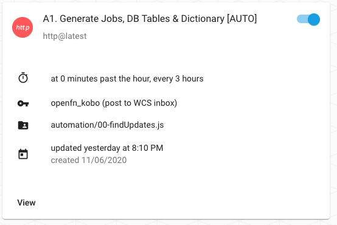
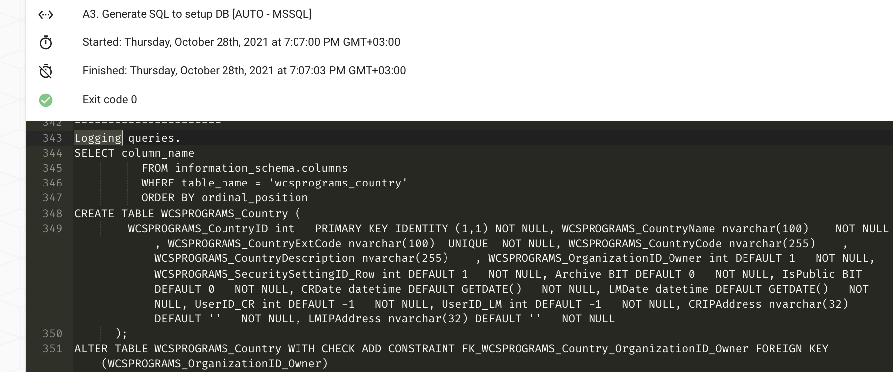
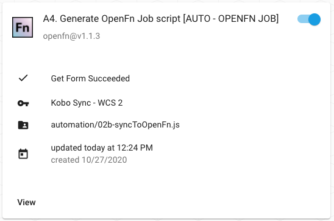
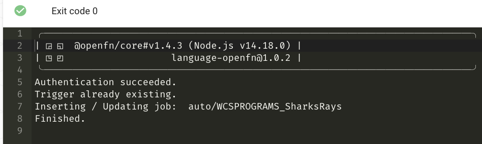
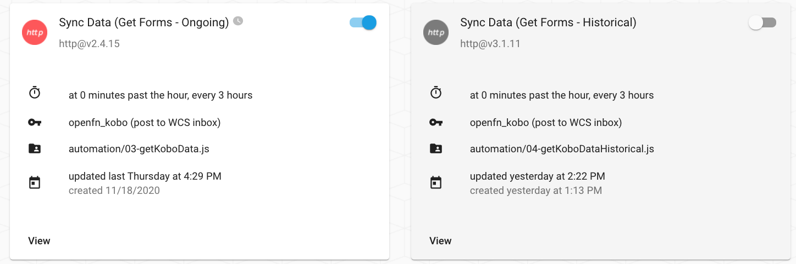

# Project 2: Automated Database Configuration & Kobo Form Integration

## Summary 
:::Quickstart
[See Slides](https://docs.google.com/presentation/d/1CdC0HL5PFzWPVRdz50c7FmRA1sVHxmnGKG_tRf-aP4M/edit?usp=sharing) for an overview and screenshots of this solution. :::


## Solution overview
The aim of the solution is to automatically integrate data from Kobo surveys collected across different partners and sites so that WCS administrators can regularly monitor and report across these data sources. 

Specifically, this solution automates integration of Kobo survey data into a Postgres database, syncing both Kobo metadata (form design changes such as question IDs and question types) and data (actual records or form submissions) between the two systems, via OpenFn. The diagram below demonstrates this flow where OpenFn... 

1. Regularly checks for new and updated forms on Kobo from a specified list of form IDs [Requires initial manual configuration] 
2. Analyses fetched forms and generates a SQL script for creating target datavase tables and columns (MSSQL and PostgreSQL compatible)
3. Creates OpenFn job for writing submission data into the tables
4. Syncs submission data from specified Kobo forms to the target DB [Requires initial manual configuration] 
5. Exports the Kobo form definition to load into "Data Dictionary" tables in the target DB to record the questions, choice values, and translations implemented in selected Kobo forms

## Specifications
### Automation Specs
This solution delivers a semi-automatic process for integration Kobo metadata and data with a connected Postgres database. 

Job `A1. Generate Jobs, DB Tables & Dictionary` that triggers the automation flow has been configured to run every 3 hours (and can be executed on demand). When run, this job will fetch specified Kobo forms from the connected Kobo account and analyze these forms to automatically (1) sync the Kobo form definition with the metadata of a destination database, and (2) create OpenFn jobs to sync the Kobo data.

See the below diagram (or [this slide](https://docs.google.com/presentation/d/1CdC0HL5PFzWPVRdz50c7FmRA1sVHxmnGKG_tRf-aP4M/edit#slide=id.gf855f49396_0_14)) for the envisioned data flow. 
[

### Automation Assumptions
1. OpenFn will check for new or changed forms in Kobo on a scheduled basis (i.e., every 3 hours). (This automation can also be run on-demand.)
2. OpenFn will not delete columns from tables in Postgres, ever.
3. OpenFn will not modify columns in Postgres, ever.
4. When a form is modified in Kobo, if fields have been added (or if a question name has been changed), OpenFn will add those columns to the existing table in Postgres.
5. When a new form is added to Kobo, OpenFn will create a corresponding table in Postgres, tables are labeled based on the ${tableId} specified in `A1. Generate Jobs, DB Tables & Dictionary`. This allows WCS admins to map 1 form to 1 table (1-to-1), or to map multiple forms to the same 1 table (many-to-1). 
6. Table columns will be created with the following data types based on Kobo question data types. This will ensure all data rows will be upserted if Kobo form data is re-processed. 

| Question Type in Kobotoolbox | Data Type in Postgres        | Data Type in MSSQL            |
|------------------------------|------------------------------|-------------------------------|
| calculate                    | varchar                      | nvarchar                      |
| date                         | date                         | date                          |
| decimal                      | float4                       | float                         |
| integer                      | int4                         | int                           |
| select_one                   | varchar (FK to lookup table) | nvarchar (FK to lookup table) |
| select_multiple              | creates Many:Many tables     | creates Many:Many tables      |
| text                         | text                         | nvarchar(max)                 |
| jsonb                        | jsonb                        | nvarchar(max)                 |
| geopoint                     | text                         | nvarchar(max)                 |

7. For every Kobo `select_one` question, will trigger a "lookup" reference table to be created and loaded with values from the questions's `choice list`. For example, if there is a `region select_one` question, the a foreign key column will be configured called `Region` that has a foreign key relationship with the parent lookup table `Region` that has values like `North`, `South`, `East`, etc. 
8. For every Kobo `select_multiple` question, will trigger a "lookup" reference table to be created and loaded with values from the questions's `choice list`, _as well as_ a "many:many" table that will relate this lookup table to the main survey table. For example, if there is a `landscale select_one` question, a lookup table `Landscape` will be generated with values like `Forest`, `Ocean`, `Desert`, etc. Then, 1 record will be inserted into a many:many table called `SurveyLandscape` for each Landscape selected for that Survey. 

9. The `end` and `start` meta columns that Kobo sends with each form submission will be saved as `date` type columns in Postgres.
10. We have created a column on each table called `generated_uuid`. When OpenFn maps data to this column, we will set its value using the following calculation:
`state.data._id + state.data._xform_id_string`
11. Forms may have multiple repeat groups. We have decided to name each child table with the following syntax: `${p1}_${p2}_${tableId}_${groupName}`.
12. When a new form is added to Kobo, OpenFn will create a new job to map that Kobo form to the table created in 5. This job will not be turned "on" by default.
13. When a form is updated, records in "child" repeat group tables, on Postgres, will be purged and then the current set of repeat group entries will be added as repeat group records in Postgres.
14. When forms have nested repeat groups (i.e., a repeat group inside a repeat group), OpenFn will create a table for each nested group. The records inside the deep group will be related to the shallow group. The records inside the shallow group will be related to the parent. Note also that OpenFn creates a column, in Postgres, for each nested repeat group table showing which record is the parent repeat group.
15. If a question is `required` in Kobo, then the corresponding DB column will have the `NOT NULL` constraint added. 


### Database Auto-Configuration Specs 
**See database configurations [specs here](https://docs.google.com/document/d/1NA2o9HKWg250u5FarWv2GDViTMuyneHTH1WBnBcT6sI/edit#).**

Kobo form definitions will be used to auto-generate SQL scripts for configuration of tables and columns in a connected Postgres database. These SQL scripts can be configured to auto-execute, or by copied/pasted and modified by database admins before execution. 

See below for how a Kobo form might be transformed to Postgres tables. Prefixes can be defined by administrators when a new Kobo form is set up in job `A1. Generate Jobs, DB Tables & Dictionary`:
- prefix1(`p1`)= organization name’s abbreviation (NOTE: `WCSPROGRAMS` is the current default)
- prefix2(`p2`) = FormGroup name (e.g., `RPT` or you can leave blank) 
- `tableId` = The desired database table name, which may be the form or survey type name (e.g., MonthlyTrainingReport). This cannot contain special characters. Example table name: `WCSPROGRAMS_RPT_MonthlyTrainingReport`
- OpenFn will create tables for each repeat group and named after their corresponding parent table ids (e.g. `WCSPROGRAMS_RPT_MonthlyTrainingReport_Events`, where `Events` is the column name of the repeat group and `MonthlyTrainingReport` is the `tableId` of the Kobo form).

See below diagram for the envisioned Kobo/Postgres Schema Mapping flow.


### Data Dictionary
To keep track of the different data tables created, WCS may create a master “Data Dictionary” table to track the metadata generated for different forms and form groups. In this initial phase, the automation solution will export Kobo form definitions for DB admins to sync when ready. 


## Administrator Guidance
While a largely automated process, there are multiple manual steps required for administrators to specify how to execute the solution and for which Kobo forms. 

### 1. Plan Your Approach: Automation vs. User Actions
See below diagram for an overview of which steps are handled by the automation solution and which steps require administrator action and manual intervention. 


### 2. Solution Setup
_Creating forms, database tables and columns ([see video walkthrough](https://drive.google.com/file/d/1hd8u3I6SQuXN62qVIzmq-raHxVpE9W0U/view?usp=sharing) for step by step guide._



#### A. Preparing for setup (pre-requisites)
1. Check the credentials associated with your OpenFn jobs to ensure they’re connecting with the correct Kobo account and destination database. 
2. Kobo form names cannot begin with an integer, nor contain special characters (e.g., `21Nov Form`, `CT.1 - Form`). This is because Postgres does not allow table or column names to begin with integers or contain special characters, so consider updating your Kobo form names. Consider re-naming your Kobo forms to ensure no errors. 

#### B. Configuring the automation flow
1. In job `A1. Generate Jobs, DB Tables & Dictionary`, find the `manualFormList` section of the job and add entry for the new form, specifying `uuid`=<form id> from Kobo, `p1`=<WCSPROGRAMS>, `p2`=<the form group name>, and `tableid` =<the name of the form> as in the example below:
```js
{ 
uid: 'a9eJJ2hrRSMCJZ95WMc93j', 
p1: 'WCSPROGRAMS', 
p2: 'swm', //or leave blank 
tableId: 'ConsommationUrbaineSwm'
}
```

2. Run job `A1. Generate Jobs, DB Tables & Dictionary`. The job can be run on demand (manually) or turn it on to allow it run automatically, as scheduled.

* The following recommendations should be observed when setting the `tableId`: 
- You must specify prefixes(`p1` and `p2`) and a `tableId` for each form, as shown above.
- `tableId` will also be used to name foriegn key relationship columns on any child tables that are generated for repeat groups in this form with the syntax: `${tableId}_uuid`.
- The `tableId` will be used by OpenFn to name the database table with the following syntax: `${p1}_${p2}_${tableId}`. `tableId` may be the same as “Name”, however 2 forms (with different “Name”) can be mapped to 1 `tableId`. 

_Examples_
1 Form: `Marche Survey 2020` → set `tableId: 'MarcheSurvey2020'` to create a table for this form
2 Forms: `Marche Survey V1`, `Marche Survey V2` → set `tableId: 'MarcheSurvey2020'` for both forms in order to map BOTH forms to the same table

:::NOTE
1. Postgres does **not** allow table or column names to begin with integers or contain special characters (e.g., `11Form`, `1-CT. Form`), so consider this when you create your desired tableId.

2. Ensure the Kobo forms have been shared with the Kobo user credential linked to this `A1` automation job. 
:::

#### C. Executing SQL Scripts
Running the `A1` job will trigger the job `A3. Set up DB with SQL` to run and auto-generate a SQL script for creating metadata (DB tables and columns) for capturing survey data. 


This SQL script can be auto-executed in a connected database, OR have auto-exucution turned _off_ so that DB administrators can manually edit the SQL script before running in a connected database. 

Recommended default: 
`{writeSql: true, execute: false}`

Administrators can manually update these  options in job `A3. Set up DB with SQL` to decide whether the SQL script should be auto-executed 
1. Choose to set `execute` as `true` or `false`
2. Choose whether it should output SQL scripts by setting `writeSql` to `true` or `false`

To configure this, click on the edit icon of the job and edit the entries on [line number 8](https://github.com/OpenFn/wcs/blob/1091374b09988e06c5322df6b76a725f488c3d0d/automation/02a-syncToPostgres.js#L8), [L19](https://github.com/OpenFn/wcs/blob/1091374b09988e06c5322df6b76a725f488c3d0d/automation/02a-syncToPostgres.js#L19), and [L35](https://github.com/OpenFn/wcs/blob/1091374b09988e06c5322df6b76a725f488c3d0d/automation/02a-syncToPostgres.js#L35) of the `A3. Set up DB with SQL`  job, setting the values to true or false as per your preference. By default this entry has the following values: `{writeSql: true, execute: true}`

Once the SQL script has been generated, search the `A3` job run log for `Logging queries` to copy/paste the full script. 

The SQL script can be manually edited as desired by the DB admin before executing in the target DB. 
[

:::Manual SQL Edits
If you make manual edits to the SQL script, remember to make corresponding updates in the OpenFn job that will sync data to the DB generated via this SQL script. 
:::

#### D. Auto-Generating OpenFn Jobs
Running the `A1` job will also trigger the job `A4. Generate OpenFn Job script` to auto-create an OpenFn job script (which can be later used to integrate Kobo data with the specified target DB).



See the `A4` run log for the name of the OpenFn job that was created/updated. 


#### E. Turning "on" the integration
When you're ready to sync data, enter your form id into one the `Sync Data` jobs. 
- If data collection is just starting or ongoing, use the `Ongoing` job. 
- To perform a one-time migration of data collected before today's date, run the `Historical` job for this form to sync the historical submissions. 
 

When editing these `Sync Data` jobs, the `tableId` should match the `Trigger` of the OpenFn job that will be used to this data to the DB. 

Therefore, if multiple forms will use 1 job to sync data to the same DB tables, then the `tableId` will be the same across all of these forms. 

  
### 2. Monitoring the integration
Monitor OpenFn `Activity History` for any run failures (learn more in [OpenFn Docs](https://docs.openfn.org/documentation.html#activity)). 

Turn “on” OpenFn notifications to receive email notifications when a run fails. To do this, navigate to your OpenFn `Account Settings` (user icon in top right corner) > for `Notifications`, select the option `Each Time`.


### 3. Kobo Form Management
Form setup considerations & best practices
1. Hidden metadata such as “Site” or “Form owner” can be added to forms as a question using a “Calculate” field. This is possible both in the Form Builder or via XLSForm. [See slides](https://docs.google.com/presentation/d/1e9UPLnEIgtDPH6_dGqgQhUyZnc3TVl8ECSwJz5JgpNQ/edit#slide=id.ga632708288_2_5) for screenshots. 
2. Where possible, Kobo form/ project names should be unique and as concise as possible–ideally not exceeding 25 characters. This helps to ensure that auto-generated database table names are easier to identify. 
3. Form repeat group names should also be as unique and concise as possible, as these will be mapped to database tables. 


