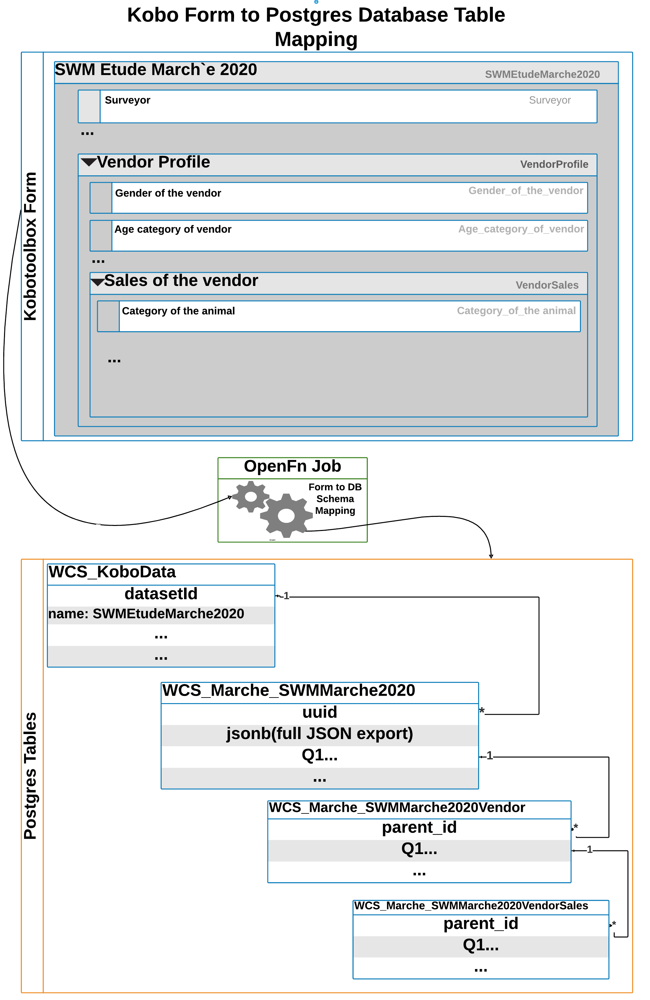

# Project 2: Automated Database Configuration & Kobo Form Integration

## Summary 
1. [See User Guide](https://docs.google.com/document/d/1_gre0rHE4WIReCHNbhgrjrCl7MdNi1fTWjgHH4Rgvug/edit?usp=sharing) for step-by-step guidance. 
2. [See Presentation](https://docs.google.com/presentation/d/1e9UPLnEIgtDPH6_dGqgQhUyZnc3TVl8ECSwJz5JgpNQ/edit?usp=sharing) for screenshots of the solution overview)
3. Video - [Solution Overview](https://www.google.com/url?q=https://www.youtube.com/watch?v%3D98h1JaGtUdY%26feature%3Dyoutu.be&sa=D&ust=1608118810078000&usg=AOvVaw2Mjp-KlgfxjSHLGsuQVnSi)
4. Video - [Automation Testing Guidance](https://www.google.com/url?q=https://www.youtube.com/watch?v%3DD3bM4VEeQV8%26feature%3Dyoutu.be%26hd%3D1&sa=D&ust=1608118810078000&usg=AOvVaw0jtqPq-gvjZLgehRzgvLmA)

## Solution overview
The aim of the solution is to automatically integrate data from Kobo surveys collected across different partners and sites so that WCS administrators can regularly monitor and report across these data sources. 

Specifically, this solution automates integration of Kobo survey data into a Postgres database, syncing both Kobo metadata (form design changes such as question IDs and question types) and data (actual records or form submissions) between the two systems, via OpenFn. The diagram below demonstrates this flow where OpenFn... 

1. Regularly checks for new and updated forms on Kobo from a specified list of form IDs [Requires initial manual configuration] 
2. Analyses fetched forms and creates SQL script for creating tables and columns
3. Updates Postgres table with new tables and columns [Optionally automated or manual step] 
4. Creates OpenFn job for writing submission data into the tables
5. Regularly fetches submission data from specified Kobo forms [Requires initial manual configuration] 
6. Writes submission data to Postgres tables

## Specifications
### Automation Specs
This solution delivers a semi-automatic process for integration Kobo metadata and data with a connected Postgres database. 

Job `00 - KOBO-AUTO 0. Find Updated Forms` that triggers the automation flow has been configured to run every 3 hours (and can be executed on demand). When run, this job will fetch specified Kobo forms from the connected Kobo account and analyze these forms to automatically (1) sync the Kobo form definition with the metadata of a destination database, and (2) create OpenFn jobs to sync the Kobo data.

See the below diagram (or [this link](https://lucid.app/lucidchart/invitations/accept/ac04f174-d0b0-4d4c-aa4b-7e23ef4501d1)) for the envisioned data flow. 
[

### Automation Assumptions
1. OpenFn will check for new or changed forms in Kobo on a scheduled basis (i.e., every 3 hours). (This automation can also be run on-demand.)
2. OpenFn will not delete columns from tables in Postgres, ever.
3. OpenFn will not modify columns in Postgres, ever.
4. When a form is modified in Kobo, if fields have been added (or if a question name has been changed), OpenFn will add those columns to the existing table in Postgres.
5. When a new form is added to Kobo, OpenFn will create a corresponding table in Postgres, tables are labeled based on the ${tableId} specified in `Job 00 - KOBO-AUTO 0. Find Updated Forms`. This allows WCS admins to map 1 form to 1 table (1-to-1), or to map multiple forms to the same 1 table (many-to-1). 
6. Table columns will be created with the following data types based on Kobo question data types. This will ensure all data rows will be upserted if Kobo form data is re-processed. 

| Question Type in Kobotoolbox | Data Type in Postgres |
|------------------------------|-----------------------|
| calculate                    | varchar               |
| date                         | date                  |
| decimal                      | float4                |
| integer                      | int4                  |
| select_one                   | varchar               |
| select_multiple              | text                  |
| text                         | text                  |
| jsonb                        | jsonb                 |
| geopoint                     | text                  |

7. The `end` and `start` meta columns that Kobo sends with each form submission will be saved as `date` type columns in Postgres.
8. We have created a column on each table called `generated_uuid`. When OpenFn maps data to this column, we will set its value using the following calculation:
`state.data._id + state.data._xform_id_string`
9. Forms may have multiple repeat groups. We have decided to name each child table with the following syntax: `${p1}_${p2}_${tableId}_${groupName}`.
10. When a new form is added to Kobo, OpenFn will create a new job to map that Kobo form to the table created in 5. This job will not be turned "on" by default.
11. When a form is updated, records in "child" repeat group tables, on Postgres, will be purged and then the current set of repeat group entries will be added as repeat group records in Postgres.
12. When forms have nested repeat groups (i.e., a repeat group inside a repeat group), OpenFn will create a table for each nested group. The records inside the deep group will be related to the shallow group. The records inside the shallow group will be related to the parent. Note also that OpenFn creates a column, in Postgres, for each nested repeat group table showing which record is the parent repeat group.


### Database Auto-Configuration Specs 
**See database configurations [specs here](https://docs.google.com/document/d/1NA2o9HKWg250u5FarWv2GDViTMuyneHTH1WBnBcT6sI/edit#).**

Kobo form definitions will be used to auto-generate SQL scripts for configuration of tables and columns in a connected Postgres database. These SQL scripts can be configured to auto-execute, or by copied/pasted and modified by database admins before execution. 

See below for how a Kobo form might be transformed to Postgres tables. Prefixes can be defined by administrators when a new Kobo form is set up in job `00-KOBO-AUTO 0. Find Updated Forms`:
- prefix1(`p1`)= organization name’s abbreviation (e.g., WCS)
- prefix2(`p2`) = FormGroup name (e.g., RPT) 
- `tableId` = The desired database table name, which may be the form or survey type name (e.g., MonthlyTrainingReport). This cannot contain special characters. Example table name: `WCS_RPT_MonthlyTrainingReport`
- OpenFn will create tables for each repeat group and named after their corresponding parent table ids (e.g. `WCS_RPT_MonthlyTrainingReport_TrainingEvents`, where `TrainingEvents` is the column name of the repeat group and `MonthlyTrainingReport` is the `tableId` of the Kobo form).

See [this 'Form/Table' diagram](https://lucid.app/lucidchart/invitations/accept/ac04f174-d0b0-4d4c-aa4b-7e23ef4501d1) below for the envisioned Kobo/Postgres Schema Mapping flow.
[

### Data Dictionary
To keep track of the different data tables created, WCS may create a master “Data Dictionary” table to track the metadata generated for different forms and form groups. In this initial phase, OFG recommends that WCS update such a table manually–but automatic updates to such a table may be discussed in a future phase. 


## Administrator Guidance
While a largely automated process, there are multiple manual steps required for administrators to specify how to execute the solution and for which Kobo forms. 

### 1. Solution Setup
_Creating forms, database tables and columns ([see video walkthrough](https://drive.google.com/file/d/1hd8u3I6SQuXN62qVIzmq-raHxVpE9W0U/view?usp=sharing) for step by step guide and [test scenarios](https://docs.google.com/spreadsheets/d/1JwXM6A-VmSfoiLxkPl6kQCuqi0cJ_w7gJfch_E6Rul0/edit#gid=349169026))._

#### A. Preparing for setup (pre-requisites)
1. Check the credentials associated with your OpenFn jobs to ensure they’re connecting with the correct Kobo account and destination database. 
2. Kobo form names cannot begin with an integer, nor contain special characters (e.g., `21Nov Form`, `CT.1 - Form`). This is because Postgres does not allow table or column names to begin with integers or contain special characters, so consider updating your Kobo form names. Consider re-naming your Kobo forms to ensure no errors. 

#### B. Configuring the automation flow
1. In job `00 - KOBO-AUTO 0. Find Updated Forms`, find the `manualFormList` section of the job and add entry for the new form, specifying `uuid`=form id from Kobo, `p1`=’WCS’, `p2`=<the form group name>, and `tableid` * =<the name of the form> as in the example below:
```
{ 
uid: 'a9eJJ2hrRSMCJZ95WMc93j', 
p1: 'WCS', 
p2: 'swm', 
tableId: 'ConsommationUrbaineSwm'
}
```
2. Run job `00 - KOBO-AUTO 0. Find Updated Forms`. The job can be run on demand(manually) or turn it on to allow it run automatically, as scheduled.

* The following recommendations should be observed when setting the `tableId`: 
- You must specify prefixes(`p1` and `p2`) and a `tableId` for each form, as shown above.
- `tableId` will also be used to name foriegn key relationship columns on any child tables that are generated for repeat groups in this form with the syntax: `${tableId}_uuid`.
- The `tableId` will be used by OpenFn to name the database table with the following syntax: `${p1}_${p2}_${tableId}`. `tableId` may be the same as “Name”, however 2 forms (with different “Name”) can be mapped to 1 `tableId`. 

_Examples_
1 Form: `Marche Survey 2020` → set `tableId: 'MarcheSurvey2020'` to create a table for this form
2 Forms: `Marche Survey V1`, `Marche Survey V2` → set `tableId: 'MarcheSurvey2020'` for both forms in order to map BOTH forms to the same table

**`Note:`** Postgres does **not** allow table or column names to begin with integers or contain special characters (e.g., `11Form`, `1-CT. Form`), so consider this when you create your desired tableId.

#### C. Executing SQL Scripts
`{writeSql: true, execute: true}`
Administrators can manually update options in job `2a - KOBO-AUTO - Sync to Postgres` to decide whether the SQL script should be auto-executed 
1. Choose to set `execute` as `true` or `false`
2. Choose whether it should output SQL scripts by setting `writeSql` to `true` or `false`

To configure this, click on the edit icon of the job and edit the entries on [line number 8](https://github.com/OpenFn/wcs/blob/1091374b09988e06c5322df6b76a725f488c3d0d/automation/02a-syncToPostgres.js#L8), [L19](https://github.com/OpenFn/wcs/blob/1091374b09988e06c5322df6b76a725f488c3d0d/automation/02a-syncToPostgres.js#L19), and [L35](https://github.com/OpenFn/wcs/blob/1091374b09988e06c5322df6b76a725f488c3d0d/automation/02a-syncToPostgres.js#L35) of the `2a - KOBO-AUTO - Sync to Postgres`  job, setting the values to true or false as per your preference. By default this entry has the following values: `{writeSql: true, execute: true}`

#### D. Turning "on" the integration
_Choose whether to write submission data to database..._
1. In job `auto/…{tableId}` related to form (e.g. a`uto/swm_etude_de_marché_2020` for form `SWM Etude Marché 2020`), add database credentials (select `WCS Automation` credential to connect to test database) and toggle or turn the job “on”
2. In job `03-KOBO-AUTO-Get Kobo Data`, add `id` (form id from Kobo), `formName`, and `destination` (`tableId` as it appears in `auto/…{tableId}` job) for a given form as shown below:
- Assuming the form id from Kobo is `an92wDyVMw4yUtCo4d7EWi`, and the name of the form in Kobo is `SWM Etude Marché 2020`, and the tableId or name of related auto job in OpenFn is `swm_etude_de_marché_2020`. In order for this job’s data to be fetched and synced with the postgres database, you would need to find and edit a section named surveys in `03-KOBO-AUTO-Get Kobo Data`, and add the following entry:
```
{
        id: 'an92wDyVMw4yUtCo4d7EWi',
        formName: 'SWM Etude Marché 2020',
        destination: ‘swm_etude_de_marché_2020’
  }
```
Note that each entry should be separated from the other by a comma(`,`) and placed inside the two [ ]  of the surveys section on [L10](https://github.com/OpenFn/wcs/blob/1091374b09988e06c5322df6b76a725f488c3d0d/automation/03-getKoboData.js#L10) of the `03-KOBO-AUTO-Get Kobo Data` job.
3. Save & Run the job
The job can be run on demand (manually) or Turn it on to allow it run automatically, as scheduled.
  
### 2. Ongoing Management
#### 1. Turning “off” the integration for specific forms
**Turn off** checking for form updates in specific forms by removing or commenting out the line containing the form ID in job `00 - KOBO-AUTO 0. Find Updated Forms`. E.g.: form in line 2 below won’t be checked for updates:
```
{ uid: 'a9eJJ2hrRSMCJZ95WMc93j', p1: 'WCS', p2: 'swm', tableId: 'ConsommationUrbaineSwm'}
// { uid: 'a9eJJ2hrRSMCJZ95Wfhsfnffs', p1: 'WCS', p2: 'marche', tableId: 'Marche2020'}
```
2. Turn off fetching submission data from specific forms using the same method in job `03-KOBO-AUTO-Get Kobo Data`. Alternatively, turn off the job for the relevant form to prevent the automation from writing data from that form into the database.

#### 2. Monitoring the integration
Monitor OpenFn `Activity History` for any run failures (learn more in [OpenFn Docs](https://docs.openfn.org/documentation.html#activity)). 

Turn “on” OpenFn notifications to receive email notifications when a run fails. To do this, navigate to your OpenFn `Account Settings` (user icon in top right corner) > for `Notifications`, select the option `Each Time`.


### 3. Kobo Form Management
Form setup considerations & best practices
1. Hidden metadata such as “Site” or “Form owner” can be added to forms as a question using a “Calculate” field. This is possible both in the Form Builder or via XLSForm. [See slides](https://docs.google.com/presentation/d/1e9UPLnEIgtDPH6_dGqgQhUyZnc3TVl8ECSwJz5JgpNQ/edit#slide=id.ga632708288_2_5) for screenshots. 
2. Where possible, Kobo form/ project names should be unique and as concise as possible–ideally not exceeding 25 characters. This helps to ensure that auto-generated database table names are easier to identify. 
3. Form repeat group names should also be as unique and concise as possible, as these will be mapped to database tables. 


