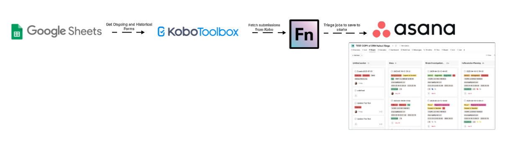
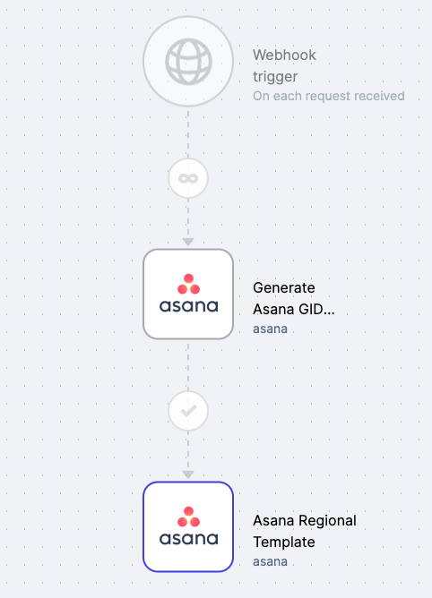
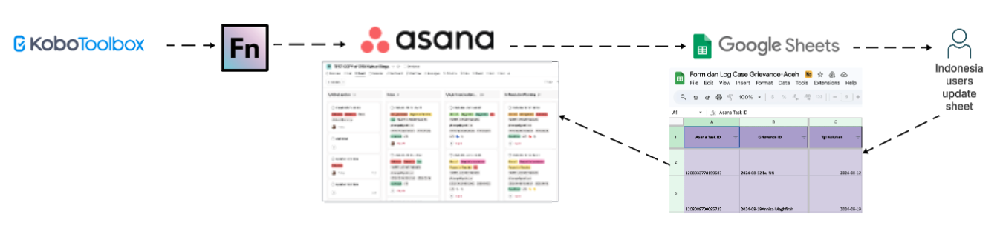

# WCS Grievances

## Project Overview & Prerequisites

The WCS Grievances project enables automated ingestion of GRM (Grievance Redress Mechanism) submissions from Kobo
Toolbox, transforming and saving these into Asana for case management. This project was originally implemented in OpenFn
V1 but has since been migrated to OpenFn V2 with several improvements to scalability and maintainability.

In the V2 version:

- Workflows have been modularized and split by region for better maintainability and clarity.
- A centralized workflow (`Get GRM Forms from Kobo`) is used to dynamically fetch configured forms and route submissions
  to the appropriate regional workflows based on the region mapping provided in the configuration spreadsheet.

### Prerequisites:

- Kobo credentials for form access
- A configuration spreadsheet containing form IDs and associated region codes
- Asana credentials and project setup per region
- Mapping documentation for each region-specific workflow

---

## Workflow Diagram



---

## Field-to-Asana Mappings

[See here](https://docs.google.com/spreadsheets/d/18AXoD-ABl8gAGDpJHiBkK8oDP6YrEsF4/edit?usp=drive_web&ouid=102832098624169374758&rtpof=true)
for the integration mapping specifications.

---

## Data Flows & Workflow Descriptions

### Overview

1. `Get GRM Forms from Kobo` fetches form metadata from the Google Sheet.
2. For each active form, it retrieves Kobo submissions from the past 7 days.
3. Submissions are enriched with metadata (e.g., region, project ID) and routed to the appropriate regional workflow.
4. The regional workflow processes and posts the data to Asana.

### Triggers & Scheduling

- The `Get GRM Forms from Kobo` workflow runs on a timer (cron) basis (every hour).
- Google Sheet configurations are read fresh on each execution, any changes to form routing or project IDs are picked up
  automatically.
- Regional workflows are triggered dynamically from the `Get GRM Forms from Kobo` workflow and are not independently
  scheduled.
- The `Get GRM Forms from Kobo` workflow can also be run on-demand with a custom date range.
    - This is useful for re-running a historical sync or recovering submissions that may have failed to sync due to connectivity issues.
    - Submissions within the specified start and end dates will be fetched and processed.
    - To trigger a manual run, provide a `daterange` object in the workflow input:
 ```json
{
  "daterange": {
    "start": "2025-08-01T00:00:00.000Z",
    "end": "2025-08-10T23:59:59.999Z"
  }
}
```  

### OpenFn Workflow Setup & Logic

#### 1. Get GRM Forms from Kobo Workflow

This workflow manages form discovery, Kobo data fetching, and submission routing.

Included Jobs:

- Get FormsList Ongoing: Reads form definitions, including formName, uid, region, and formId
- Get Kobo Forms Ongoing:
    - Retrieves Kobo data using the uid.
    - Rejects undefined or old cursors (>7 days)
    - Sends valid submissions to the right region workflow

#### 2. [Region] Sync to Asana Workflow

The WCS Grievances project is modularized into region-specific workflows. Each workflow corresponds to one of WCS’s
programmatic regions and contains the logic to process and post GRM form submissions from Kobo into the relevant Asana
project.

Regional workflows now follow a search-before-create pattern to prevent duplicate tasks in Asana.

- One job per Kobo form handled in that region
- Jobs are responsible for:
    - Cleaning and validating incoming Kobo submissions
    - Searching Asana by a unique identifier (e.g., `CaseID` or `GrievanceID`)
    - Creating a new task only if no match exists

**Regional Workflows Summary**
Below is a list of all regional workflows and their corresponding responsibilities:

| Region                                   | Workflow Name on OpenFn |
|------------------------------------------|--------------------------|
| East Africa Western Indian Ocean & Madagascar | `EAWIO Sync to Asana`        |
| Global                                   | `Global Sync to Asana`       |
| Greater Mekong                           | `Greater Mekong Sync to Asana`          |
| Andes, Amazon & Orinoco                  | `AAO Sync to Asana`          |
| Central Africa & Gulf of Guinea          | `CAGG Sync to Asana`          |
| Mesoamerica & Western Caribbean          | `MesoAmerica Sync to Asana`          |
| Patagonia                                | `Patagonia Sync to Asana`          |
| Southeast Asia Pacific                   | `SAP 1. Sync to Asana` and `SAP 2. Update Asana Task Aceh`          |
| Sudano-Sahel                             | `Sudano Sahel Sync to Asana`          |

For scalability, WCS also required that this integration be designed such that multiple versions of the Kobo form (with
identical fields) can be mapped to their own corresponding project tasks in Asana.

There are two types of fields to be mapped:

i. Open-Ended Kobo Fields: These fields are NOT drop-down fields. They are typically Date fields or fields that accept
free text input from the user. The key-value pair statements needed to populate the custom fields are auto-generated in
Job #1. These ones are mapped as follows:

```json
custom_fields: {
    '1203712049265363': $.inputData.body.StaffEmail,
     '1202329899911595': $.inputData.body.CaseID,
} 
```

ii. Multiple Choice / Drop-down Kobo fields. These fields typically have a list of pre-defined choices that users must
select from. In Asana, these are mapped to `enum_options` which also have their unique gid values for every single
choice in kobo. The key-value pair statements needed to populate the custom fields are also auto-generated in the generator job.
These parameters are structured as follows:

```json
custom_fields: {
    '1202330347491974': state => state.formatMapping["ReportFormat_" + $.inputData.body.ReportFormat],
    '1202330737362426': state => state.formatMapping["Gender_" + $.inputData.body.Gender],
}  
```

For example, the `Country` field and its answer options were each mapped to gids as follows:
```
Country_Bolivia: '1208823831314340',
Country_Brazil: '1208823831314341',
Country_Colombia: '1208823831314342',
```

The task name in Asana is set using a unique identifier, such as:
```
name: $.inputData.body.GrievanceID,
```

Before creating the task, the workflow queries Asana:
```
request(`/workspaces/${state.configuration.workspaceGid}/tasks/search`, {
    query: {
        'custom_fields.1201884379104074.value': $.inputData?.body?.GrievanceID,
        resource_subtype: 'default_task'
    }
});
```
If a task is found, creation is skipped. Otherwise, a new task is created with the mapped fields.

> ⚠ *Notes for developers:*
> - An example of this `Create Job`  is linked to the Github file [`/asana/createTask.js`](https://github.com/OpenFn/ConSoSci/blob/master/asana/createTask.js).
> - On OpenFn.org this job is configured with the `asana` adaptor which is activated every time a Kobo form is fetched with a matching name (e.g., `{"formName":"WCS Global Grievances"}`).

#### 3. Asana Mapping Template

This workflow generates the Asana custom field IDs and the copy-paste snippets you will use in the regional workflows.

**What this job does**
- Reads a real task from the target Asana project
- Builds a combined `formatMapping` of enum choices
- Emits two paste blocks:
  - **PASTE 1** a mapping table you load into `state.formatMapping`
  - **PASTE 2** a `custom_fields` object body tailored to the fields actually present in that project

**Before you run it**

Open the generator job and replace the sample task id at the top:

```javascript
// Paste that task's gid below.
const SAMPLE_TASK_GID = "<<<REPLACE_WITH_TASK_GID>>>";
```
Pick this gid by creating or opening any task in the target project and copying the Task ID from the URL:
`https://app.asana.com/1/<Workspace_gid>/project/<Project_gid>/task/<Task_gid>`

**Where the Project gid lives**
- Project gid is visible in the URL: `https://app.asana.com/1/<Workspace_gid>/project/<Project_gid>/list`
- You do not need the Project gid for the generator, but it helps you confirm you are looking at the right project.

**What shows up in the logs**
- The job fetches the task and inspects its `custom_fields`
- It prints two clean, copy-paste blocks, bounded by markers

PASTE 1 (put this in STEP 1 of your regional job):
```javascript
const formatMapping = { /* many "Field_Option": "gid" pairs */ };
state.formatMapping = formatMapping;
```
PASTE 2 (paste only the inner lines into the custom_fields object of createTask):
```javascript
custom_fields: {
  '1202329899911595': $.inputData.body.CaseID,
  '1202330347491974': state => state.formatMapping["ReportFormat_" + $.inputData.body.ReportFormat],
  '1210398577520508': state => state.formatMapping["Request Response_" + $.inputData.body['Request Response']],
  // ...
}
```
**How to use the outputs**
1. In your regional job, STEP 1:
   - Replace the two commented lines with the two lines from PASTE 1
2. In your regional job, inside `createTask({ ... })`:
   - Paste only the lines from PASTE 2 into the existing `custom_fields: { ... }`

Example output from the generator job
```javascript
-----BEGIN PASTE 1-----
const formatMapping = {
  "SubmissionType_Grievance": "1202329899911646",
  "ReportFormat_Email": "1202330347502485",
  // ...
};
state.formatMapping = formatMapping;
-----END PASTE 1-----

-----BEGIN PASTE 2-----
custom_fields: {
  '1202329899911595': $.inputData.body.CaseID,
  '1202330347491974': state => state.formatMapping["ReportFormat_" + $.inputData.body.ReportFormat],
  '1210398577520508': state => state.formatMapping["Request Response_" + $.inputData.body['Request Response']],
  // ...
}
-----END PASTE 2-----
```

That is it. Set `SAMPLE_TASK_GID`, run the generator, then drop PASTE 1 and PASTE 2 into the regional job in the two places noted above.

This job is run *only once* as the Asana field gids for a given project are unique and do not change. 

> ⚠ *Notes for developers:*
> - An example of this `Asana Mapping Template` job is linked to the Github file [`/asana/template-generator.js`](https://github.com/OpenFn/ConSoSci/blob/master/asana/template-generator.js).
> - On OpenFn.org this job is configured with the `asana` adaptor and a `webhook` trigger.



### Special Flow: Indonesia (Aceh)

The `SAP 1. Sync to Asana` and `SAP 2. Update Asana Task Aceh` workflows support a customized workflow for the
Indonesia (Aceh) region. In addition to syncing Kobo submissions to Asana, this region also syncs submissions to a
protected GoogleSheet used for ongoing updates by the WCS Indonesia team.

#### 1. SAP 1. Sync to Asana

After a Kobo submission is upserted as a task in Asana via the `SAP 1. Sync to Asana` job, the data is also written to a
designated GoogleSheet. This secondary sync:

- Cleans, maps, and loads the Kobo data into the sheet.
- Stores the `Asana Task ID` as the unique identifier for each row.
- Enables a one-to-one mapping between Kobo and sheet records:

      1 Kobo submission => 1 row in GoogleSheets

- Includes protected ranges to prevent deletion or editing of sensitive fields. Only specific users (WCS Indonesia and
  the document owner) can edit rows or trigger changes.

📘 Refer to
the [GRM GoogleSheets User Guide](https://docs.google.com/document/d/1vAPLG1Sc4pSe6L0z3J5qVfmQFcvuJ1zEGmEKuExs5iI/edit)
for more on sheet permissions and usage.

#### 2. SAP 2. Update Asana Task Aceh

The `SAP 2. Update Asana Task Aceh` workflow is triggered when changes are made in the GoogleSheet.

- A **Google Apps Script** runs daily at midnight UTC and sends updated rows to OpenFn.
- Alternatively, users can manually trigger the sync by clicking the **"OpenFn Sync"** button in the sheet.
- The job:
    - Locates the corresponding task in Asana using the stored `Asana Task ID`
    - Maps and loads updated field values from the sheet
    - Only syncs fields listed in the `MAP 2: GoogleSheets → Asana` tab in
      the [mapping specs](https://docs.google.com/spreadsheets/d/1D3_smWDjelubR_Lg-1xex9TLl6lAEGMSbGDyw8whqx4/edit#gid=373544466)

📘 See
the [GRM GoogleSheets User Guide](https://docs.google.com/document/d/1vAPLG1Sc4pSe6L0z3J5qVfmQFcvuJ1zEGmEKuExs5iI/edit)
for more information about editable fields and triggering syncs.



This hybrid workflow enables both task creation in Asana and spreadsheet-based case management by local teams. OpenFn
ensures that updates made in the GoogleSheet are reflected in Asana, keeping the two systems synchronized for consistent
case tracking and follow-up.

---

### Assumptions

1. The jobs and mapping design are based on
   this [KoboToolBox to Asana Integration Requirement](https://docs.google.com/document/d/1blAjAyZ1UfDI-3zDdf38sXYqevroGQVHxOkFWseNTS4/edit#)
   of WCS.
2. All data cleaning will be done in Kobo Toolbox. Every time Kobo data is received, OpenFn first checks for a matching
   task record in Asana, If a match is found, the Task is updated with new details. If a matching task is not found, a
   new Task is created in Asana with the data fields populated.
3. The uuid used for syncing with the destination DB is the Kobo answer `_id`. The combination of `GrievanceID` and
   Kobo `_id_` creates a unique identifier for each form across various systems that would interact wit this data. **
   Note:** `uuid` may vary, and hence not a reliable unique identifier.
4. Only the GoogleSheets document owner and the WCS GoogleSheets integration user will be able to update the protected
   ranges in the GoogleSheet or delete rows in the Sheet.
5. The `Update Asana Task` should always find the Asana task using the uuid `Asana Task Id`. If the task is not found in
   Asana it may have been deleted in Asana or someone may have changed the ID in the GoogleSheet. If assumption number 1
   is met, only the WCS user and the document owner would have the privileges to update the ID the GoogleSheet.
6. Because Asana tasks can be moved to different projects, Asana users should make sure OpenFn has access to those
   project spaces so that the integration will always find the task to be updated.
7. The GoogleSheet sharing setting will remain set to "Restricted - Only people with access can open with the link" so
   that any changes made to the document will be associated with a user.

---

### Administration & Support

#### Provisioning, Hosting, & Maintenance

- This integration is hosted on OpenFn.org with hosted SaaS.
- The KoboToolBox Forms managed by WCS

#### Questions or support needed?

- For new project setup or scale-up requests, contact: [Diane Detoeuf](ddetoeuf@wcs.org), [Vanesa Reyes](vreyes@wcs.org)
  , [Omar Torrico](otorrico@wcs.org), [Wendy Acahuana](wacahuana@wcs.org)
- For technical support, raise a ticket via [support@openfn.org](support@openfn.org)

