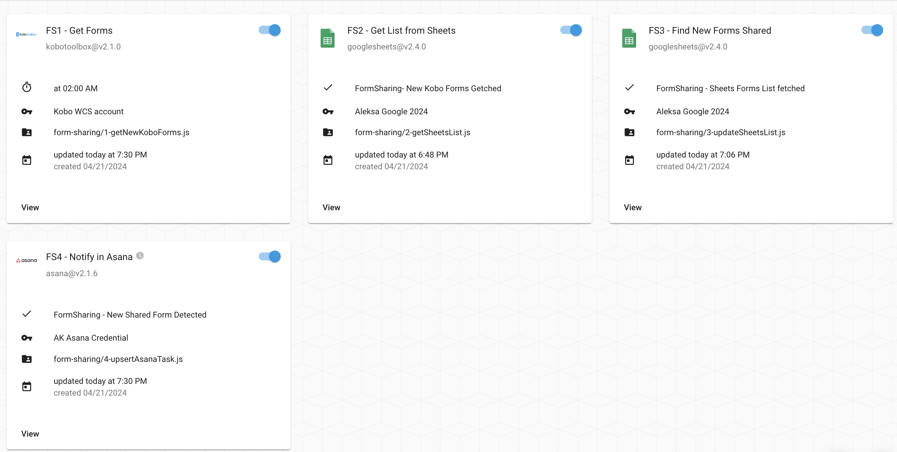
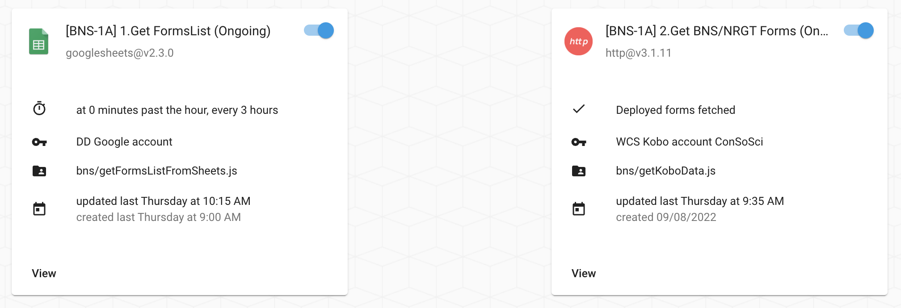
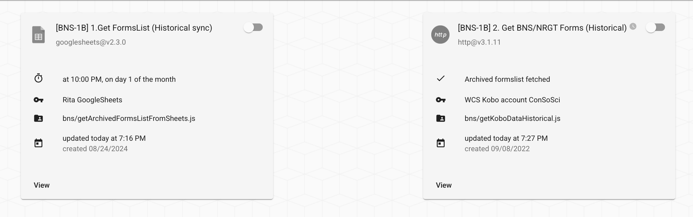
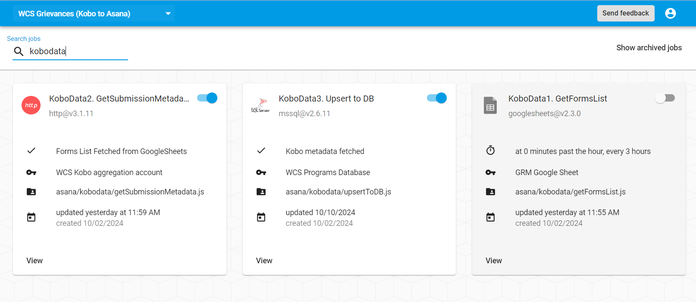

# Kobo Form Sharing Notification for WCS Admins

Lists of "deployed" and "archived" Kobo BNS/NRGT forms for data collection are stored in [this Google Sheet](https://docs.google.com/spreadsheets/d/1s7K3kxzm5AlpwiALattyc7D9_aIyqWmo2ubcQIUlqlY/edit?gid=1559623602#gid=1559623602). 

The below "Form Sharing" workflows have been configured in OpenFn. See the [form-sharing](https://github.com/OpenFn/ConSoSci/tree/master/form-sharing) directory for the underlying code. 

🎥 **[See this video](https://www.loom.com/share/4dbaa205e60c45d3be17fdde1dcc64a6?sid=b4c3e321-e1ed-4250-9367-d67e101bb543)** for an overview of how the solution works, and the below sections on how to manage the forms list in the Google Sheet. 

When the workflow runs, it will: 
1. Check the connected Kobo accounts for form updates
2. Compare any updated forms with the list of deployed forms in the ["Deployed" Forms Sheet](https://docs.google.com/spreadsheets/d/1s7K3kxzm5AlpwiALattyc7D9_aIyqWmo2ubcQIUlqlY/edit?gid=1559623602#gid=1559623602)
3. Add any newly deployed forms to the Sheet
4. Update rows in the ["Deployed" Sheet](https://docs.google.com/spreadsheets/d/1s7K3kxzm5AlpwiALattyc7D9_aIyqWmo2ubcQIUlqlY/edit?gid=1559623602#gid=1559623602) if forms are archived, and then add the archived form to the ["Archived" Sheet](https://docs.google.com/spreadsheets/d/1s7K3kxzm5AlpwiALattyc7D9_aIyqWmo2ubcQIUlqlY/edit?gid=1965562058#gid=1965562058)
5. Assign Asana Task(s) to the WCS admin to review every form newly deployed or archived

## Managing the Forms Lists in Google Sheets
[This Master Forms Sheet](https://docs.google.com/spreadsheets/d/1s7K3kxzm5AlpwiALattyc7D9_aIyqWmo2ubcQIUlqlY/edit?gid=1559623602#gid=1559623602) is now the source of truth for what Kobo forms should or should not be synced to the ConSoSci database. Update the column `automate_sync` to true/false to specify whether these forms should be included when either the [BNS-1A Ongoing](https://v1.openfn.org/projects/consosci/jobs/E7cauG) or [BNS-1B Historical](https://v1.openfn.org/projects/consosci/jobs/gNALVP) "Get forms" jobs run.

## Syncing BNS/NRGT Kobo Form Submissions
Now with this [Master Forms Sheet](https://docs.google.com/spreadsheets/d/1s7K3kxzm5AlpwiALattyc7D9_aIyqWmo2ubcQIUlqlY/edit?gid=1559623602#gid=1559623602) set up, there are 3 workflows configured to sync BNS and NRGT forms on an ongoing and historical basis in the `ConSoSci` project. 

🎥 **[See this video](https://www.loom.com/share/1cf1021e73f945e8a13e792df8d3afe3?sid=29269619-3b3f-485f-998b-3c65aeb03bff) for how to manage _ongoing_ data syncing of deployed Kobo forms.**

1. **Ongoing sync**: The `[BNS1-A]` jobs will sync "deployed" Kobo forms (where `automate_sync: true` in the [deployed forms sheet](https://docs.google.com/spreadsheets/d/1s7K3kxzm5AlpwiALattyc7D9_aIyqWmo2ubcQIUlqlY/edit?gid=1559623602#gid=1559623602)). 

2. **Historical sync**: The `[BNS1-B]` jobs will sync ALL historical submissions for Kobo forms (where `historical_sync: true` in EITHER the [deployed forms sheet](https://docs.google.com/spreadsheets/d/1s7K3kxzm5AlpwiALattyc7D9_aIyqWmo2ubcQIUlqlY/edit?gid=1559623602#gid=1559623602) or the [archived forms sheet](https://docs.google.com/spreadsheets/d/1s7K3kxzm5AlpwiALattyc7D9_aIyqWmo2ubcQIUlqlY/edit?gid=1965562058#gid=1965562058)). 

## Syncing Kobo metadata for GRM forms

An additional workflow has been set up to fetch deployed GRM form data from the [Master Forms Sheet](https://docs.google.com/spreadsheets/d/1s7K3kxzm5AlpwiALattyc7D9_aIyqWmo2ubcQIUlqlY/edit?gid=1559623602#gid=1559623602), get metadata (submission count, last submission date) from Kobo for those forms, and then update the WCS Programs Database KoboData table with the metadata.

## Specifications
- Original [Github technical specification](https://github.com/OpenFn/ConSoSci/issues/206) and the [workflow diagram (v2)](https://lucid.app/lucidchart/346b8e5c-6fb6-4a33-9d02-53e5059bd698/edit?invitationId=inv_d1431bce-05ae-4005-9b6a-9c279141a3a3&page=0_0#)
- [Change request](https://github.com/OpenFn/ConSoSci/issues/224) for how archived forms are managed 

## How to re-process Kobo form submissions & re-sync historical data
1. Go to the [Master Forms Sheet](https://docs.google.com/spreadsheets/d/1s7K3kxzm5AlpwiALattyc7D9_aIyqWmo2ubcQIUlqlY/edit?gid=1559623602#gid=1559623602) and update the column `historical_sync: true` for ANY deployed or archived form that you want to sync. 
2. In the ConSoSci project space, run the job **[`[BNS-1B] 1.Get FormsList (Historical sync)`](https://v1.openfn.org/projects/consosci/jobs/gNALVP)**.

🎥 **See this [Historical Sync video](https://www.loom.com/share/e92d337784db44b58485421515d2a36b?sid=67e4a117-df45-451f-a5a4-3de80fb9e8d1)** for guidance on bulk syncing historical submissions for any form–deployed or historical.
