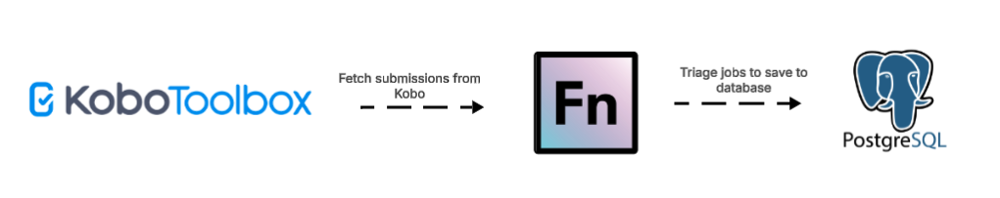

# Wildmeat (Currently Inactive)
**🛑 Project Status: Inactive**

## Project Overview & Prerequisites

EU SWM uses Kobo Toolbox to collect data on Rural Consumption across sites (see
the [Kobo form template here](https://docs.google.com/spreadsheets/d/1AN2Qyjx-ua3fE5-Nj7Bg2WSdZdIE6zy4FmVVrMqGZl0/edit?usp=drive_web&ouid=101430720901034004945)). OpenFn automates data integration between Kobo
Toolbox and a Postgresql transitional database.

- **Kobo Forms Supported**:
  - Rural Consumption
  - Urban Consumption
  - Market
  - Offtake

> ⚠️ The `study_id` and `site_id` values are currently hardcoded in jobs. All surveys will default to `study_id: 1000` and `site_id: 1001` unless otherwise defined per form type.

---

## Workflow Diagram

---

## Field-to-DB Mappings

| Kobo Form Type     | DB Table                  | Unique ID / Mapping Key                          |
|--------------------|---------------------------|--------------------------------------------------|
| All                | `tbl_site`                | `site_id = 1001` (default)                       |
| All                | `tbl_study`               | `study_id = 1000` (default)                      |
| Rural Consumption  | `tbl_sample`              | `_id + _xform_id_string`                         |
| Rural Consumption  | `tbl_household`           | `survey_info/household_id`                      |
| Rural Consumption  | `tbl_household_char`      | `_id`                                            |
| Rural Consumption  | `tbl_individual`          | `_id`                                            |
| Rural Consumption  | `tbl_individual_char`     | `_id`                                            |
| Rural Consumption  | `tbl_wildmeat`            | Loop over `group_food[]`, assign `wildmeat_id`   |
| Urban Consumption  | `tbl_sample_urban`        | `_id + _xform_id_string`                         |
| Urban Consumption  | `tbl_individual_urban`    | `_id`                                            |
| Urban Consumption  | `tbl_wildmeat_urban`      | `split domeat_species[]` or `bm_species[]`       |
| Market             | `tbl_market`              | `market` (external ID)                           |
| Market             | `tbl_sample_market`       | `_id + _xform_id_string`                         |
| Market             | `tbl_wildmeat_market`     | Nested in `vendor[].sales[]`                     |
| Offtake            | `tbl_hunter_monitoring`   | `id_hunter`                                      |
| Offtake            | `tbl_sample_hunter`       | `_id + _xform_id_string`                         |
| Offtake            | `tbl_wildmeat_hunter`     | Loop over `animal_details[]`                     |
| All                | `swm_transaction`         | `_id + _xform_id_string`, includes full JSON     |

---

## Data Flows & Workflow Descriptions
###  Overview

1. **Fetch Kobo Data**: A scheduled job retrieves submissions from Kobo forms (using form ID and name).
2. **Triage Submissions**: The submissions are passed to a triage job that determines which transformation job should process the record.
3. **Sync to DB**: Each transformation job parses the submission and performs an upsert to the target database tables.

All transformation jobs are written in JavaScript using OpenFn’s PostgreSQL language package.

### Triggers & Scheduling

| Workflow                                | Trigger Type | Frequency          |
|-----------------------------------------|--------------|--------------------|
| Sync Data (Get Kobo Forms – Ongoing)    | Cron         | Daily              |
| Sync Kobo data to PG                    | Webhook      | Real-time per form |
| Reset Database                          | Cron         | Manual             |

### Job Code Structure

#### 1. Validate the submission

Before doing anything, the job checks:
- Has the respondent provided consent?
- Is the submission marked as valid (not a test or duplicate)?
- Does it contain all required fields like `_id`, species, region, etc.?

If a submission is missing key fields or consent, it is skipped and logged for follow-up.

#### 2. Read and clean form responses

Form responses from Kobo are extracted using `dataValue()` and cleaned:
- Extra spaces or invalid characters are removed
- Boolean fields (like yes/no) are standardized
- Dates are reformatted if needed

This ensures all values are clean and usable before inserting into the database.

#### 3. Match response values to internal codes

Many fields in the Kobo forms (such as species or region) use coded dropdowns. These need to be matched to official database records (like species IDs) using:
- Lookups in preloaded tables (e.g., species reference)
- `findValue()` or `findMapping()` to resolve labels to IDs

This guarantees consistency across all database entries.

#### 4. Build database records

Once values are cleaned and matched, the job builds structured "records" to match the destination tables. Each form typically results in:
- A **parent record** (e.g., survey metadata in `tbl_sample`)
- Multiple **child records** (e.g., wildmeat entries in `tbl_wildmeat`, individuals in `tbl_individual`)

All records are given unique IDs (e.g., `GeneratedUuid`) to track and link them reliably.

### 5. Insert using `upsert()` and `upsertMany()`

Records are inserted into the database using:
- `upsert()` for individual records (e.g., one household or one transaction)
- `upsertMany()` for repeat groups (e.g., species observed, vendors, individual characteristics)

The upsert method ensures that:
- Existing records are updated (not duplicated)
- New records are added only once

 --- 
### Assumptions

- `study_id` and `site_id` values are hardcoded for now. These default to:
  - Urban Consumption: 1000
  - Rural Consumption: 1002
  - Market: 1004
  - Offtake: 1006
- Species matching relies on codes submitted in Kobo forms. The species names and taxon IDs are not matched unless a master reference list is already populated in the DB.
- All forms must include consent (`consent_checklist == 'yes'`) to be processed.
- Forms use different repeat groups (e.g., `group_food`, `vendor.sales`, `animal_details`) to capture wildmeat data.
- Some calculated values (e.g., `massin_grams`) are derived at runtime.

---

## Administration & Support

#### Provisioning, Hosting, & Maintenance
- This integration is hosted on OpenFn.org with hosted SaaS.
- The KoboToolBox Forms managed by WCS

####  Questions or support needed?
Contact support@openfn.org. 
