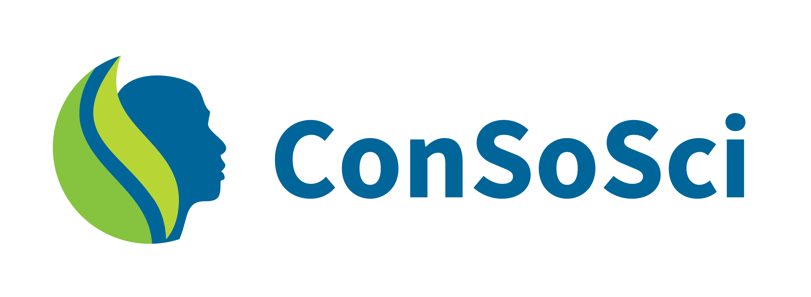

# ConSoSci Documentation

Welcome to the ConSoSci/OpenFn integration docs site. Search or explore the
documentation for several projects aimed at improving the efficiency of wildlife
and wildlands conservation projects around the world.

## About
Conservation Social Science (ConSoSci) partnership is leveraging social science to strengthen conservation outcomes. 

This repo includes OpenFn-powered integration solutions for ConSoSci partners to connect data sources, including Kobo Toolbox, PostgreSQL and MySQL databases.

## Workstreams

- Project 1: BNS and NGRT Kobo survey integrations for centralized data management & analysis
- Project 2: Automated Kobo integration to autogenerate database tables & OpenFn jobs for data integration
- Project 3: Wildmeat Kobo surveys integration to track consumption data
- Project 4: KoboToolbox to Asana integration to track grievance data
- Project 5: Form Sharing Notifications, to notify the database administrator when new Kobo forms are shared with the aggregating account, so that they can be incuded in the integration workflow 

## OpenFn Projects

Relevant ConSoSci/WCS system administrators have access the following OpenFn.org projects for integration monitoring & management.

1. `WCS` --> source code hosted on `wcs` Github repo: [https://github.com/OpenFn/ConSoSci](https://github.com/OpenFn/ConSoSci)
2. `Wildmeat` --> source code hosted on `wcs-wildmeat` Github repo: [https://github.com/OpenFn/wcs-wildmeat](https://github.com/OpenFn/wcs-wildmeat)

## Training & Support
Contact [info@consosci.org](mailto://info@consosci.org), post on the [OpenFn Community](https://community.openfn.org/), or learn more on [OpenFn Docs](https://docs.openfn.org). 

