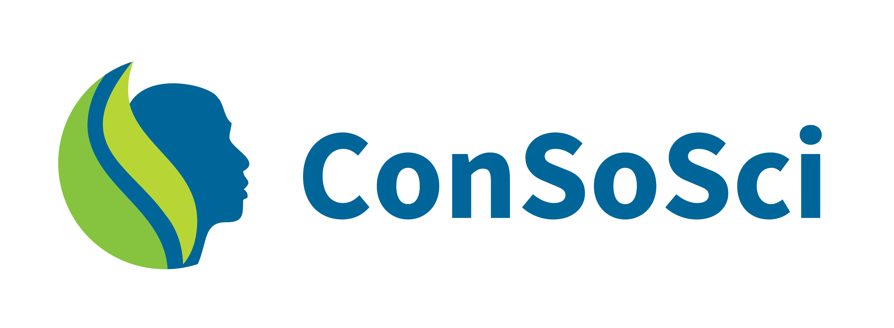

# ConSoSci Documentation

## About
Welcome to the ConSoSci/OpenFn integration documentation site. Here, you can search or browse through resources for a range of projects focused on boosting the efficiency of wildlife and wildlands conservation efforts worldwide.

The Conservation Social Science (ConSoSci) partnership uses social science to help drive stronger, more sustainable conservation outcomes. This repo features OpenFn-powered integration tools built for ConSoSci partners that makes it easier to connect systems like Kobo Toolbox, PostgreSQL, and MSSQL databases.

Want to learn more about the OpenFn–ConSoSci collaboration? Check out this [video](https://drive.google.com/drive/folders/1Ic6xvHN9k5u0hClfAT-wMecRAvlZ3NlH).

## Workstreams

The ConSoSci team manages several integration projects, each supporting a different survey or reporting use case. The table below lists current projects, their purposes, and links to their associated GitHub repositories.

<table>
  <tr>
   <td><strong>V1</strong>
   </td>
   <td><strong>V2 Project</strong>
   </td>
   <td><strong>Descriptions</strong>
   </td>
   <td><strong>Github</strong>
   </td>
   <td><strong>Status</strong>
   </td>
  </tr>
  <tr>
   <td>ConSoSci
   </td>
   <td><strong>social-sciences</strong>
   </td>
   <td>Based on ConSoSci templates: For integrating BNS and NRGT forms, monitoring Kobo forms shared with the global WCS account, and automating integration setup for new Kobo forms.
   </td>
   <td><a href="https://github.com/OpenFn/ConSoSci">ConScoSci</a>
   </td>
   <td>Active
   </td>
  </tr>
  <tr>
   <td>WildMeat
   </td>
   <td><strong>wildmeat</strong>
   </td>
   <td>For integration Wildmeat consumption forms collected on Kobo across multiple organizations into 1 central, structured Wildmeat DB
   </td>
   <td><a href="https://github.com/OpenFn/wcs-wildmeat">wcs-wildmeat</a>
   </td>
   <td>Inactive
   </td>
  </tr>
  <tr>
   <td>ConSoSci Training
   </td>
   <td><strong>wcs-training</strong>
   </td>
   <td>ConSoSci training project first setup in 2021 for WCS & ConSoSci users
   </td>
   <td><a href="https://github.com/OpenFn/consocsci-training">consocsci-training</a>
   </td>
   <td>Active
   </td>
  </tr>
  <tr>
   <td>WCS
   </td>
   <td><strong>wcs-miscellaneous</strong>
   </td>
   <td>WCS workflows used internally to sync other project-specific surveys to the WCS Programs DB
   </td>
   <td><a href="https://github.com/WCS-ConsTech/OpenFn-WCS-Projects">OpenFn-WCS-Projects</a>
   </td>
   <td>Active
   </td>
  </tr>
  <tr>
   <td>Trillion Trees
   </td>
   <td><strong>trillion-trees</strong>
   </td>
   <td>For Trillion Trees-specific surveys, include the Rapid Form Deployment Automation 
   </td>
   <td><a href="https://github.com/WCS-ConsTech/OpenFn-TrillionTrees">OpenFn-TrillionTrees</a>
   </td>
   <td>Active
   </td>
  </tr>
  <tr>
   <td>WCS Grievance
   </td>
   <td><strong>wcs-grievances</strong>
   </td>
   <td>For managing grievance reporting and follow-up workflows between Kobo, Asana, and Google Sheets
   </td>
   <td><a href="https://github.com/OpenFn/ConSoSci">ConScoSci</a>
   </td>
   <td>Active
   </td>
  </tr>
</table>

## v1 → v2 Migration Changes

The new OpenFn platform (called Lightning or v2) introduces big improvements over the old v1 system. These changes make it faster, easier to use, and more secure.

### Here’s what’s new in v2:
- **You can build workflows visually:** There's now a drag-and-drop builder where you can design and test your integrations, no need to write code line by line.
- **It’s easier to monitor and fix things:** You can see exactly what happened in every run: what data came in, what went out, and any errors. You can retry a failed run in one click.
- **It’s faster and handles more data:** The system is now built to handle large volumes and complex workflows without slowing down.
- **Better security and control:** Organizations can now choose how long to store data, who can access what, and have clearer audit logs of activity.
- **It’s open-source and easier to host:** Just like v1, v2 can be self-hosted. Now it’s even easier with Docker templates and documentation available on GitHub.

👉 Want to learn more? Read the full announcement blog here:[ Lightning is here](https://www.openfn.org/blog/lightning-is-here)

